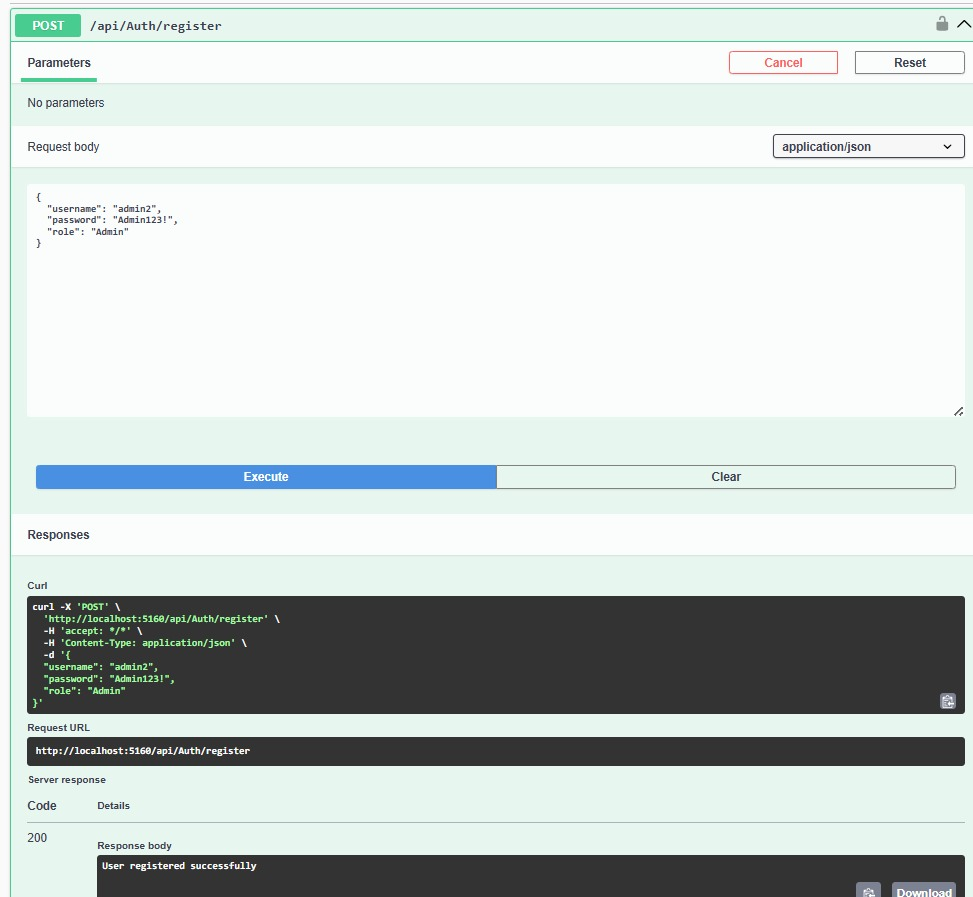
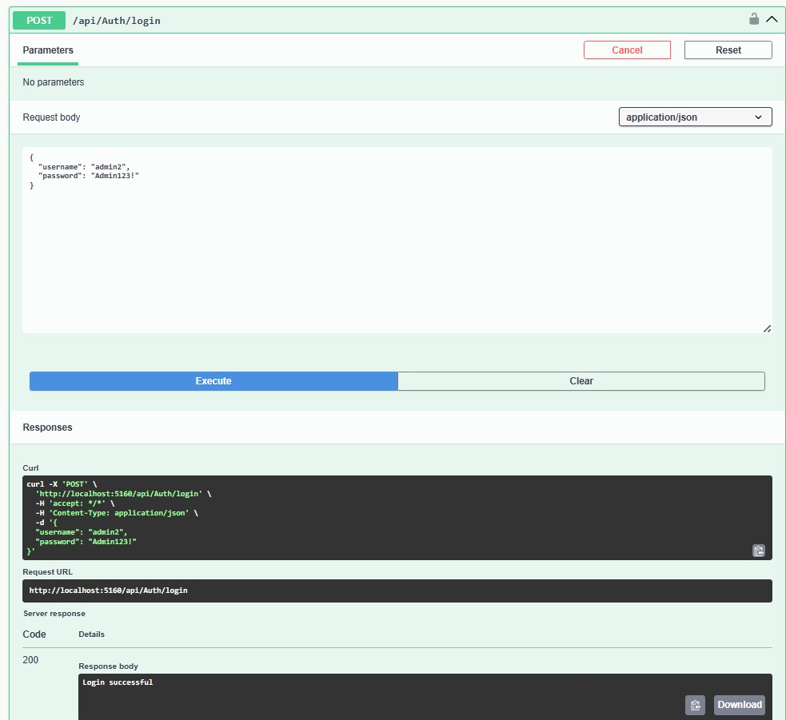
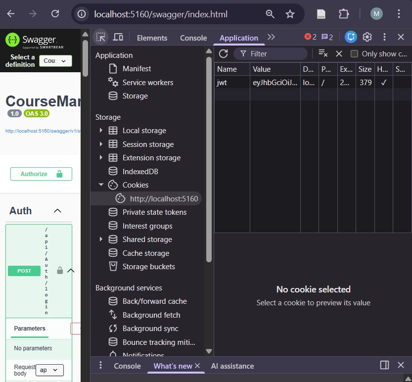
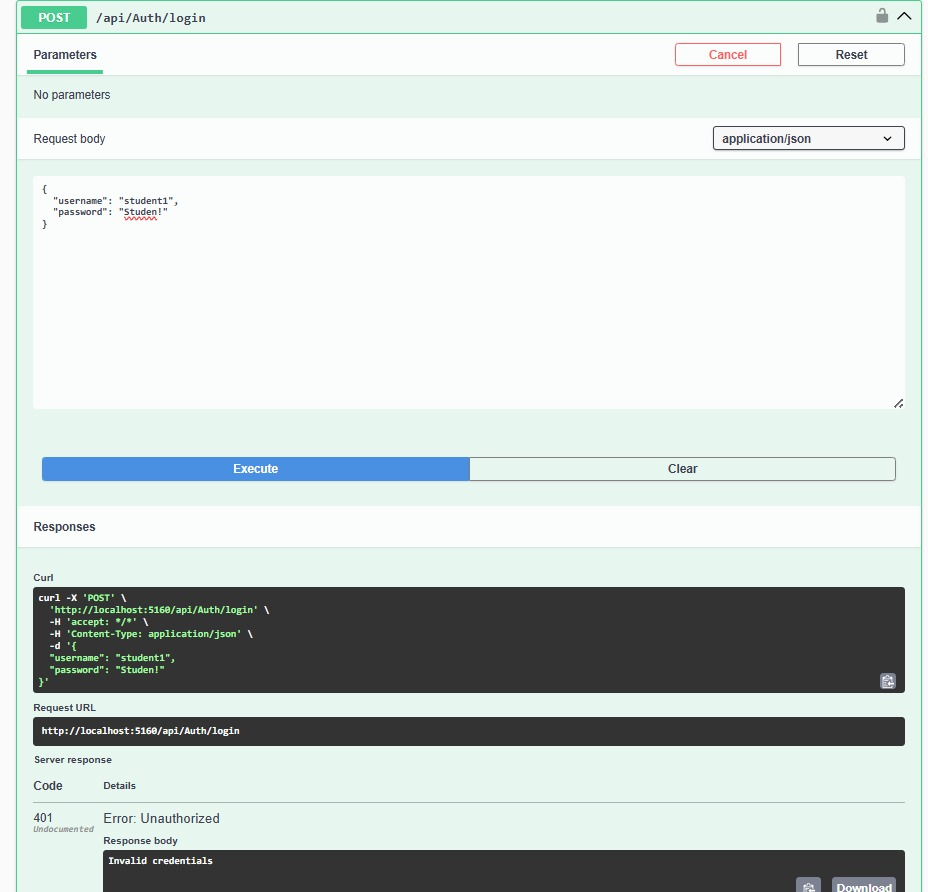
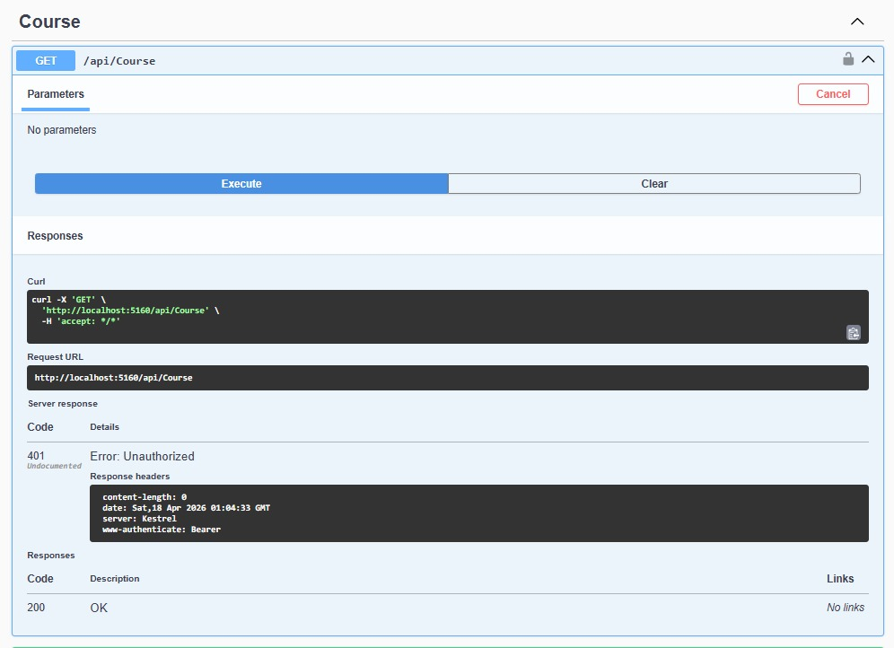
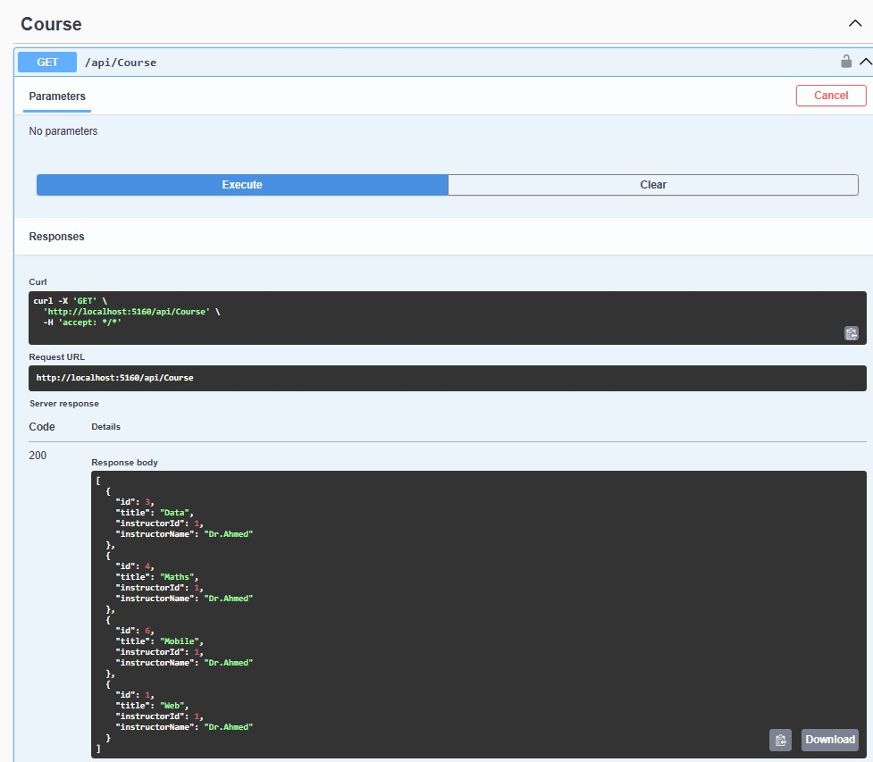
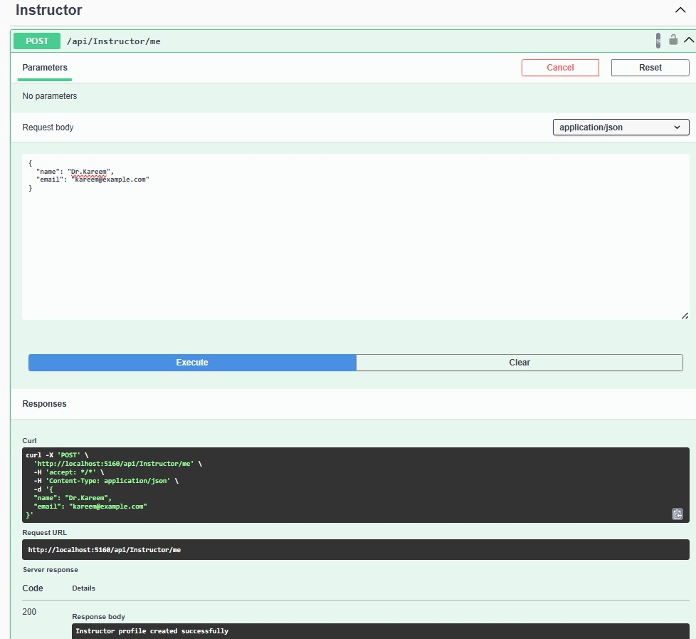
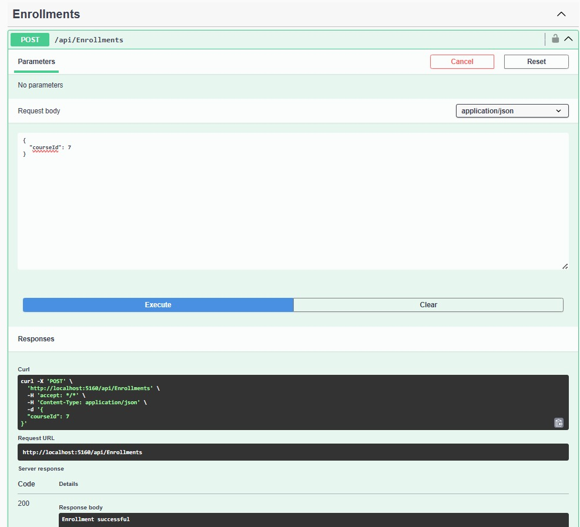
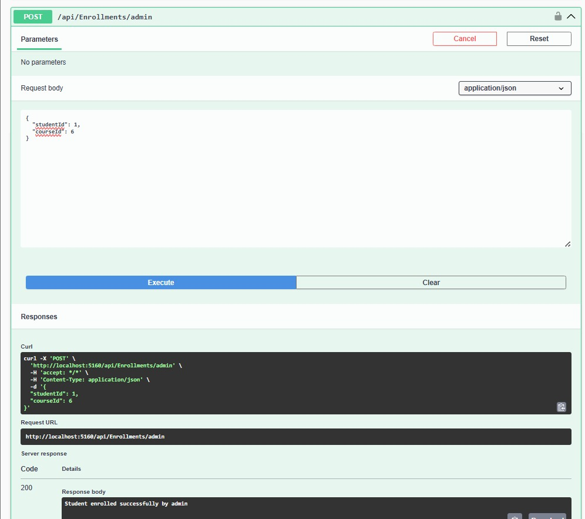

# Course Management System API

## Project Description

The **Course Management System API** is a RESTful Web API built using **ASP.NET Core**, **Entity Framework Core**, and **ASP.NET Identity**.

The system manages:

- Students
- Instructors
- Courses
- Instructor Profiles
- Enrollments
- Authenticated Users

This project demonstrates:

- Entity relationships
- Dependency Injection
- Service layer architecture
- DTO usage with validation
- ASP.NET Identity authentication
- JWT cookie-based authentication
- Role-based Authorization
- Secure profile ownership using JWT claims
- LINQ query optimization
- AsNoTracking() performance optimization
- Swagger API documentation

This assignment serves as the foundation for the final course project.

---

# Technologies Used

## ASP.NET Core Web API

Used to build RESTful endpoints for handling HTTP requests such as:

GET  
POST  
PUT  
DELETE

---

## Entity Framework Core

Used as the ORM (Object Relational Mapper) to communicate with SQL Server and manage database relationships.

---

## SQL Server

Used as the relational database to store application data.

---

## ASP.NET Identity

Used for secure user management including:

- Password hashing
- Role-based authentication
- Secure user ownership
- Integration with JWT authentication

---

## Dependency Injection

Used to inject database context and services into controllers for clean architecture.

Controllers do NOT communicate directly with the database.

---

## JWT Authentication (HTTP-Only Cookies)

JWT tokens are generated after login and stored securely inside **HTTP-Only cookies**.

Benefits:

- Prevent JavaScript access to authentication tokens
- Protect against Cross-Site Scripting (XSS)
- Automatically attach to authenticated requests
- Improve authentication security

---

## Role-Based Authorization

Access to endpoints is restricted depending on user roles:

Admin  
Instructor  
Student

Example:

```csharp
[Authorize]
```

```csharp
[Authorize(Roles = "Admin")]
```

---

## Swagger (OpenAPI)

Swagger is used to:

- Document API endpoints
- Test requests
- Authenticate users
- View request/response models

Swagger runs automatically when the project starts.

---

# System Entities

The system includes the following entities:

- Student
- Instructor
- Course
- InstructorProfile
- Enrollment
- User (ASP.NET Identity authentication entity)

---

# Entity Relationships

The following relationships are implemented using Entity Framework Core:

## One-to-One Relationship

Instructor → InstructorProfile

Each instructor has exactly one profile containing additional information.

---

## One-to-Many Relationship

Instructor → Courses

Each instructor can teach multiple courses.

---

## Many-to-Many Relationship

Student ↔ Course (via Enrollment table)

Students can enroll in multiple courses and courses can contain multiple students.

---

# Secure Profile Ownership Design

Each authenticated user creates **only their own profile**.

The system extracts **UserId from JWT claims** instead of accepting it from request bodies.

Example:

Students cannot create profiles for other students  
Instructors cannot create profiles for other instructors

This ensures secure ownership of profiles.

---

# Service Layer Architecture

The system implements a service layer between controllers and database context.

Implemented services:

- CourseService
- StudentService
- InstructorService
- EnrollmentService
- JwtService

Controllers do NOT communicate directly with the database.

Services use Dependency Injection to access the database context.

---

# DTO Implementation

DTOs (Data Transfer Objects) are used to separate API request/response models from database entities.

Implemented DTO types:

## Create DTOs

Example:

CreateCourseDto

Used when creating new records.

---

## Update DTOs

Example:

UpdateCourseDto

Used when updating existing records.

---

## Read DTOs

Example:

CourseDto

Returned from API instead of entity models.

Controllers never return entity models directly.

---

# DTO Validation

DTO validation is implemented using Data Annotation attributes:

Examples:

- Required
- MaxLength
- MinLength
- Range
- EmailAddress

Invalid requests return:

HTTP 400 Bad Request

Validation occurs before database operations.

---

# Authentication Flow

## Register User

POST /api/Auth/register

Example:

```json
{
  "username": "admin1",
  "password": "123456",
  "role": "Admin"
}
```

---

## Login User

POST /api/Auth/login

Server:

- validates credentials
- generates JWT token
- stores token inside HTTP-only cookie

Cookie is automatically attached to future requests.

---

## Logout User

POST /api/Auth/logout

Removes authentication cookie.

---

# Authorization Rules

## Admin Permissions

Admin users can:

- Create courses
- Update courses
- Delete courses
- View all students
- Delete students
- View all instructors
- Delete instructors
- Enroll any student in any course

---

## Instructor Permissions

Instructor users can:

Create their own instructor profile:

POST /api/Instructor/me

View students enrolled in their courses:

GET /api/Enrollments/course/{courseId}

---

## Student Permissions

Student users can:

Create their own student profile:

POST /api/Student/me

View their own profile:

GET /api/Student/me

Enroll themselves in courses:

POST /api/Enrollments

Example:

```json
{
  "courseId": 2
}
```

View their enrolled courses:

GET /api/Enrollments/my-courses

---

# Enrollment Security Design

Students cannot enroll other students.

StudentId is NOT accepted from request body.

Instead:

UserId is extracted from JWT claims and resolved internally into StudentId.

Admins can enroll any student using:

POST /api/Enrollments/admin

Example:

```json
{
  "studentId": 1,
  "courseId": 2
}
```

Students enroll themselves using:

POST /api/Enrollments

Example:

```json
{
  "courseId": 2
}
```

---

# LINQ Query Optimization

LINQ Select() projections are used to return only required fields.

Example:

```csharp
_context.Courses
.AsNoTracking()
.Select(c => new CourseDto
{
    Id = c.Id,
    Title = c.Title
})
```

This improves performance and reduces memory usage.

---

# AsNoTracking Performance Optimization

All read-only queries use:

```csharp
AsNoTracking()
```

This improves performance because Entity Framework does not track returned objects.

---

# Async Database Operations

Async methods are used for database access:

Examples:

```csharp
ToListAsync()
FirstOrDefaultAsync()
SaveChangesAsync()
```

This improves application performance and scalability.

---

# Database Migrations

Entity Framework Core migrations are used to create and update the database schema.

Example commands:

```
dotnet ef migrations add InitialIdentitySetup
dotnet ef database update
```

---


## API Endpoints Overview

### Authentication

| Endpoint | Method | Access |
|---------|--------|--------|
| /api/Auth/register | POST | Public |
| /api/Auth/login | POST | Public |
| /api/Auth/logout | POST | Authenticated |

### Students

| Endpoint | Method | Access |
|---------|--------|--------|
| /api/Student/me | POST | Student |
| /api/Student/me | GET | Student |
| /api/Student | GET | Admin |
| /api/Student/{id} | DELETE | Admin |

### Instructors

| Endpoint | Method | Access |
|---------|--------|--------|
| /api/Instructor/me | POST | Instructor |
| /api/Instructor | GET | Admin |

### Courses

| Endpoint | Method | Access |
|---------|--------|--------|
| /api/Course | GET | Authenticated |
| /api/Course | POST | Admin |
| /api/Course/{id} | PUT | Admin |
| /api/Course/{id} | DELETE | Admin |

### Enrollments

| Endpoint | Method | Access |
|---------|--------|--------|
| /api/Enrollments | POST | Student |
| /api/Enrollments/admin | POST | Admin |
| /api/Enrollments/my-courses | GET | Student |
| /api/Enrollments/course/{id} | GET | Instructor / Admin |


## Security Design

The system implements multiple security layers:

- ASP.NET Identity for password hashing and secure authentication
- JWT authentication stored inside HTTP-only cookies
- Role-based authorization (Admin / Instructor / Student)
- Profile ownership validation using JWT claims
- Prevention of duplicate enrollments
- Prevention of duplicate instructor/student profiles
- Protection against unauthorized data access between students


## Database Design Strategy

The database schema was designed using Entity Framework Core relationships:

- One-to-One → Instructor ↔ InstructorProfile
- One-to-Many → Instructor → Courses
- Many-to-Many → Students ↔ Courses (via Enrollment table)

Composite keys were implemented inside the Enrollment table to prevent duplicate registrations.

Unique constraints were applied to:

- Student email
- Instructor email
- Course title per instructor


# How to Run the Project

Clone repository:

```
git clone REPOSITORY_URL
```

Navigate to project folder:

```
cd CourseManagementAPI
```

Update connection string inside:

```
appsettings.json
```

Apply migrations:

```
dotnet ef database update
```

Run project:

```
dotnet run
```

Open Swagger:

```
http://localhost:xxxx/swagger
```

---


# Screenshots

## Successful admin registration using ASP.NET Identity authentication system


## Successful login and secure JWT cookie generation using HTTP-only cookies




## Invalid Login Attempt (Unauthorized Access)


## Unauthorized access attempt blocked before authentication


## Retrieve Courses After Authentication


## Instructor creates their own profile securely using JWT claim-based ownership


## Student enrolls themselves in a course using secure claim-based student identity


## Admins enroll students in a course using student Id and course Id



