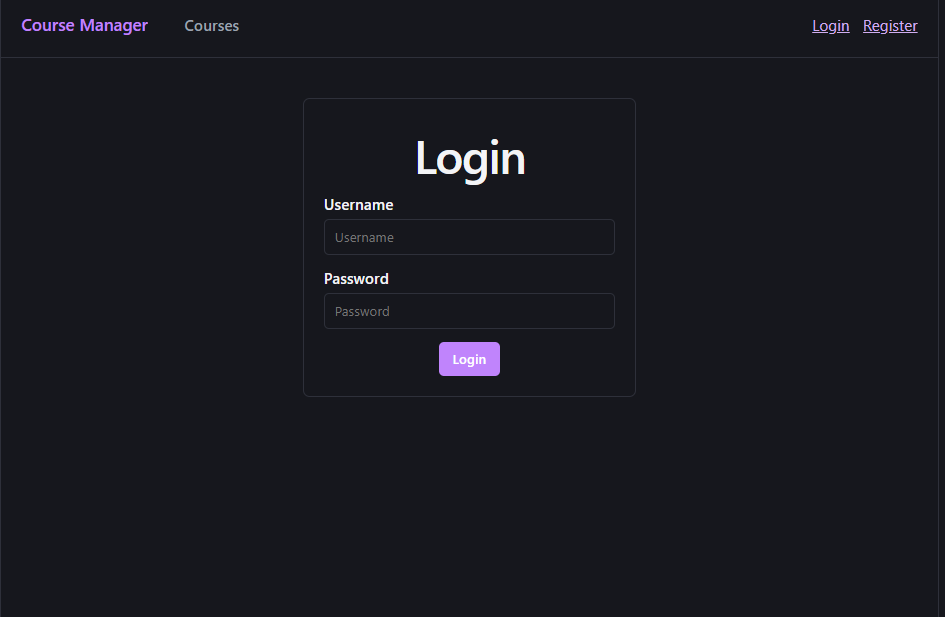
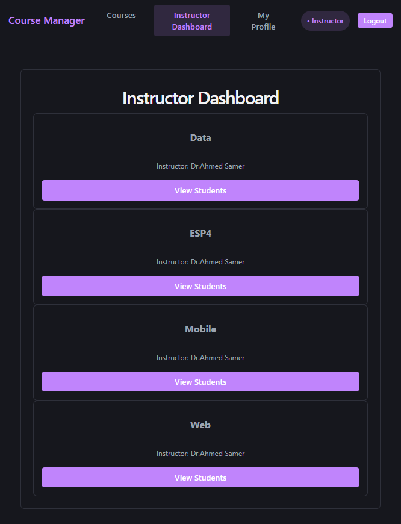
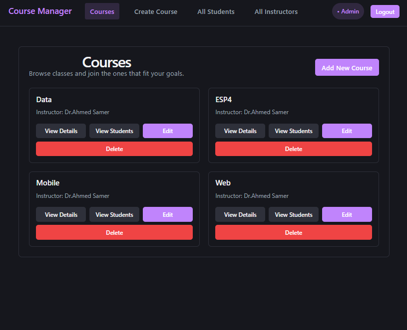
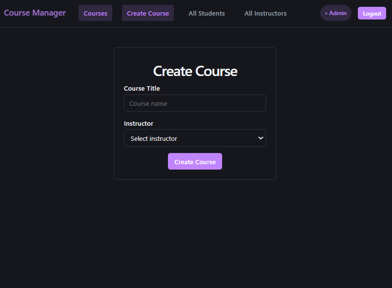

# 📚 Course Management System

## 📌 Application Description

This project is a full-stack web application that allows users to manage courses, students, and instructors.

The system enables:

* Students to enroll in courses
* Instructors to manage courses
* Admin to manage students, instructors, and enrollments

The frontend is built using React and is fully integrated with a backend API using Axios.

---

## 🛠️ Technologies Used

### Frontend

* React
* React Router
* Axios

### Backend

* ASP.NET Core Web API
* Entity Framework Core
* SQL Server

---

## 📂 Project Structure

### Frontend (React)

src/
├── assets/
├── components/
├── pages/
├── services/
├── context/
├── routes/
├── App.jsx
├── main.jsx
├── index.css
├── App.css
---

## 🔗 API Routes Used

### Auth

* POST /api/Auth/login
* POST /api/Auth/register
* POST /api/Auth/logout

### Courses

* GET /api/Course
* POST /api/Course
* PUT /api/Course/{id}
* DELETE /api/Course/{id}

### Students

* GET /api/Student
* DELETE /api/Student/{id}
* GET /api/Student/me

### Enrollments

* POST /api/Enrollments
* DELETE /api/Enrollments
* GET /api/Enrollments/my-courses

---

## ⚙️ Setup Instructions

### Backend

1. Open the folder: CourseManagementAPI
2. Run the following command:
   dotnet run

---

### Frontend

1. Open the folder: course-management-frontend
2. Run:
   npm install
   npm run dev

---

## 🌐 Features Implemented (Based on Requirements)

✔ React file structure organized into components, pages, and services
✔ Routing using React Router (multiple routes implemented)
✔ Axios used for API communication
✔ State management using useState
✔ Forms with controlled inputs
✔ Full CRUD operations (Create, Read, Update, Delete)
✔ Navigation between pages

---

## 📸 Screenshots

### Login Page

### Dashboard

### Courses Page

### Create Course Form

### Profile Page

### Remove Student from Course

---

##  Student Name: 

Mennatullah Amr